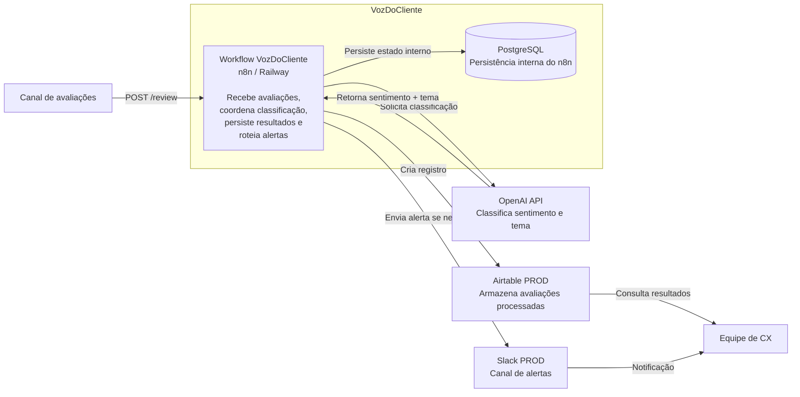

# Arquitetura C4 — Nível 2: Containers

## Visão geral

O VozDoCliente é implementado com um workflow principal em n8n, responsável por receber avaliações, consultar um modelo de linguagem, persistir os resultados e enviar alertas quando necessário.

## Containers e serviços

| Elemento | Tecnologia | Responsabilidade |
| --- | --- | --- |
| Workflow principal | n8n no Railway | Receber avaliações, orquestrar classificação, deduplicar, persistir resultados e enviar alertas |
| Persistência interna | PostgreSQL | Armazenar dados internos do n8n em produção |
| Serviço de LLM | OpenAI API | Classificar sentimento e tema da avaliação |
| Persistência de negócio | Airtable PROD | Armazenar avaliações e classificações |
| Notificação | Slack PROD | Alertar a equipe de CX sobre avaliações negativas |

## Responsabilidades internas do workflow

O workflow n8n executa internamente as seguintes etapas:

1. recebe a avaliação via webhook;
2. envia o texto ao serviço de LLM;
3. interpreta e valida a resposta recebida;
4. registra a avaliação processada no Airtable;
5. identifica avaliações negativas;
6. envia alerta ao Slack quando necessário.

Os nodes individuais do n8n não são representados como containers, pois fazem parte da implementação interna do workflow.

## Ambientes

### Desenvolvimento

- n8n via Docker;
- LM Studio;
- Qwen3-4B;
- Airtable DEV;
- Slack DEV.

### Produção

- n8n no Railway;
- PostgreSQL;
- OpenAI API;
- Airtable PROD;
- Slack PROD.

A lógica principal do workflow permanece equivalente entre os ambientes, enquanto infraestrutura, modelo e credenciais são separados.