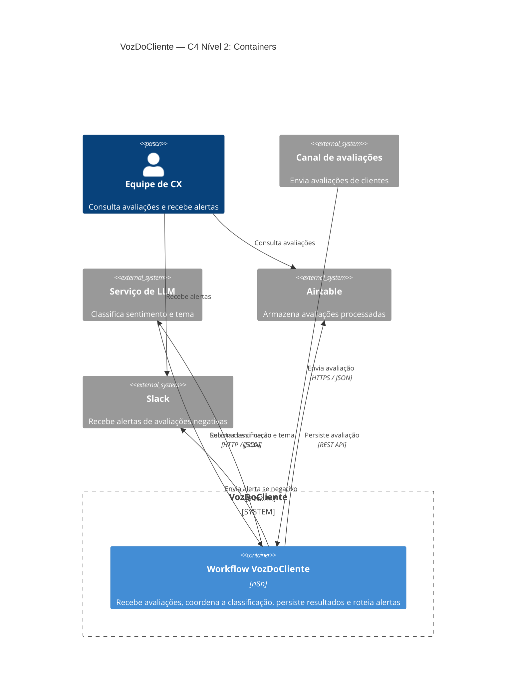

# C4 — Nível 2: Contêineres do Sistema

## Objetivo

Detalhar os principais componentes técnicos do VozDoCliente e as relações entre eles.

```mermaid
C4Container
title VozDoCliente — C4 Nível 2: Containers

Person(cx, "Equipe de CX", "Consulta avaliações e recebe alertas")

System_Ext(source, "Canal de avaliações", "Envia avaliações de clientes")
System_Ext(llm, "Serviço de LLM", "Classifica sentimento e tema")
System_Ext(airtable, "Airtable", "Armazena avaliações processadas")
System_Ext(slack, "Slack", "Recebe alertas de avaliações negativas")

System_Boundary(vozdocliente, "VozDoCliente") {
    Container(n8n, "Workflow VozDoCliente", "n8n", "Recebe avaliações, coordena a classificação, persiste resultados e roteia alertas")
}

Rel(source, n8n, "Envia avaliação", "HTTPS / JSON")
Rel(n8n, llm, "Solicita classificação", "HTTP / JSON")
Rel(llm, n8n, "Retorna sentimento e tema", "JSON")
Rel(n8n, airtable, "Persiste avaliação", "REST API")
Rel(n8n, slack, "Envia alerta se negativo", "Slack API")
Rel(cx, airtable, "Consulta avaliações")
Rel(cx, slack, "Recebe alertas")
```