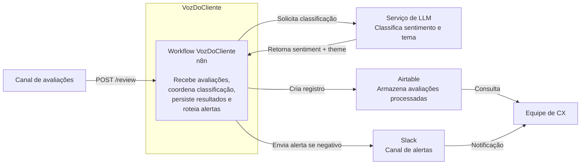

# Arquitetura C4 — Nível 2: Containers

## Visão geral

O VozDoCliente é implementado com um workflow principal em n8n, responsável por receber avaliações, consultar um modelo de linguagem, persistir os resultados e enviar alertas quando necessário.

## Containers e serviços

| Elemento | Tecnologia | Responsabilidade |
| --- | --- | --- |
| Workflow principal | n8n | Receber avaliações, orquestrar classificação, persistir resultados e enviar alertas |
| Serviço de LLM | API compatível com OpenAI | Classificar sentimento e tema da avaliação |
| Persistência | Airtable | Armazenar avaliações e classificações |
| Notificação | Slack | Alertar a equipe de CX sobre avaliações negativas |

## Responsabilidades internas do workflow

O workflow n8n executa internamente as seguintes etapas:

1. recebe a avaliação via webhook;
2. envia o texto ao serviço de LLM;
3. interpreta e valida a resposta recebida;
4. registra a avaliação processada no Airtable;
5. identifica avaliações negativas;
6. envia alerta ao Slack quando necessário.

Os nodes individuais do n8n não são representados como containers, pois fazem parte da implementação interna do workflow.

## Ambientes

Em desenvolvimento, o serviço de LLM é fornecido pelo LM Studio com Qwen3-4B.

Em produção, o mesmo ponto de integração será configurado para utilizar uma API externa de LLM.

A estrutura lógica do sistema permanece a mesma nos dois ambientes.