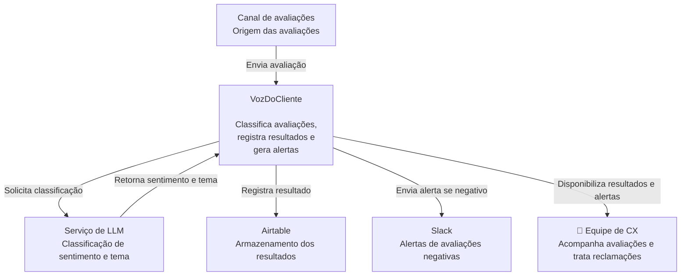

# Arquitetura C4 — Nível 1: Contexto do Sistema

## Visão geral

O VozDoCliente automatiza o processamento de avaliações de clientes. O sistema recebe uma avaliação, utiliza um modelo de linguagem para classificar seu sentimento e tema, registra o resultado e gera um alerta quando identifica uma avaliação negativa.

## Elementos

### Equipe de CX

Usuário operacional do VozDoCliente. Acompanha avaliações processadas e atua sobre casos que demandam atendimento.

### Canal de avaliações

Representa o sistema ou serviço responsável por enviar avaliações de clientes ao VozDoCliente.

### VozDoCliente

Sistema responsável por coordenar o processamento das avaliações, classificação, persistência e geração de alertas.

### Serviço de LLM

Sistema externo responsável por classificar o texto da avaliação por sentimento e tema.

### Airtable

Serviço externo utilizado para persistir avaliações processadas e suas classificações.

### Slack

Serviço externo utilizado para entregar alertas de avaliações negativas à equipe de CX.