# Evidências do Projeto — VozDoCliente

Este documento reúne evidências visuais e operacionais da evolução do protótipo VozDoCliente, cobrindo desenvolvimento local, integração com LLM, persistência, alertas, smoke tests, CI/CD, deploy público e rollback.

## 1. Workflow n8n no ambiente de desenvolvimento

A imagem abaixo mostra o fluxo principal executado no n8n durante o desenvolvimento local, com recebimento do review via webhook, classificação por LLM, tratamento dos dados, persistência no Airtable e roteamento condicional para o Slack.

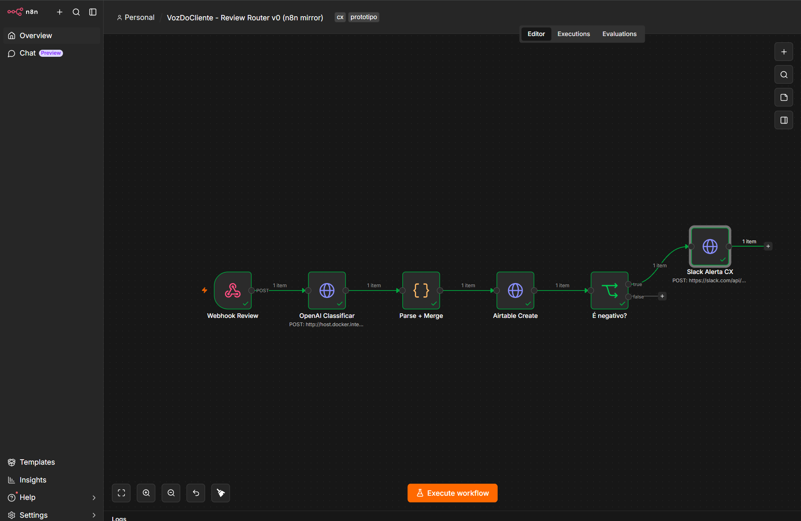

**Comprova:**
- uso do n8n como orquestrador;
- existência de um fluxo executável localmente;
- integração entre webhook, LLM, Airtable e Slack.

## 2. Classificação local com LLM

O ambiente DEV foi validado com um modelo Qwen servido pelo LM Studio através de endpoint compatível com a API de chat completions.

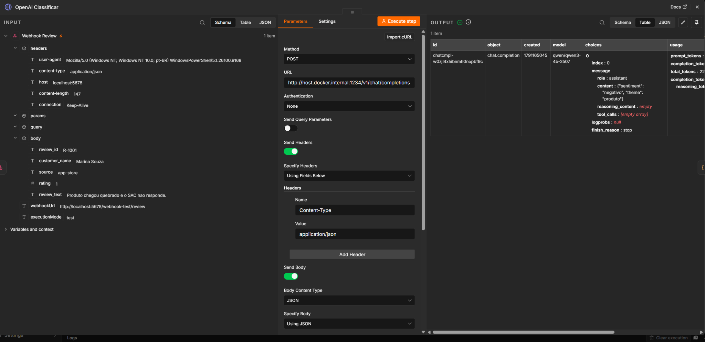

A evidência mostra uma avaliação negativa sendo classificada com sentimento `negativo` e tema `produto`.

**Comprova:**
- execução local independente da API de produção;
- classificação estruturada de sentimento e tema;
- separação entre ambiente de desenvolvimento e produção.

## 3. Tratamento e normalização da resposta

Após a classificação, o node `Parse + Merge` combina a resposta do modelo com os dados originais recebidos pelo webhook.

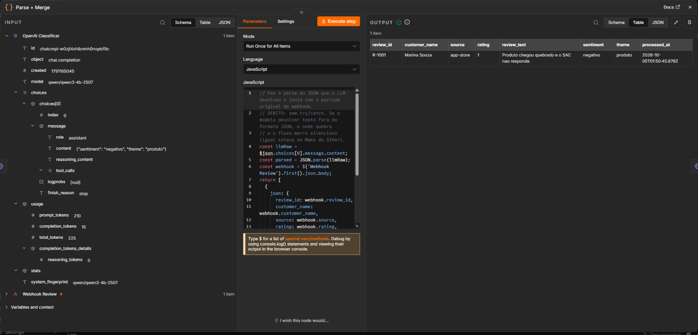

**Comprova:**
- transformação da resposta do modelo em estrutura utilizada pelo restante do workflow;
- preservação de `review_id`, cliente, origem, nota e texto;
- inclusão de `sentiment`, `theme` e `processed_at`.

## 4. Roteamento de avaliações negativas

A condição `É negativo?` avalia o sentimento processado e encaminha apenas avaliações negativas para o fluxo de alerta.

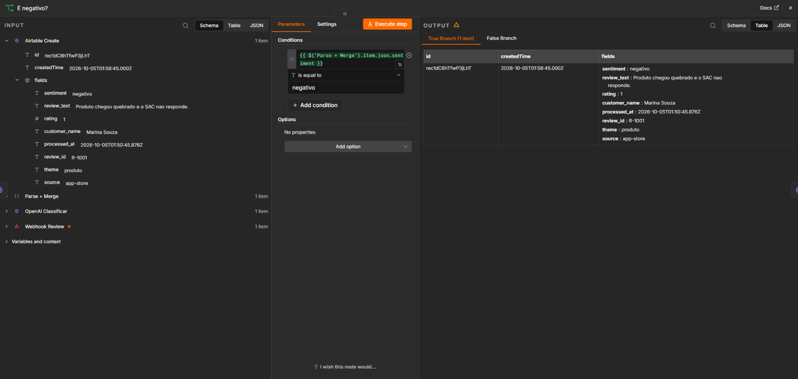

**Comprova:**
- decisão condicional no workflow;
- avaliações negativas seguem para o alerta;
- avaliações não negativas não são encaminhadas ao Slack.

## 5. Persistência no Airtable DEV

A persistência dos resultados foi validada no Airtable durante o desenvolvimento.

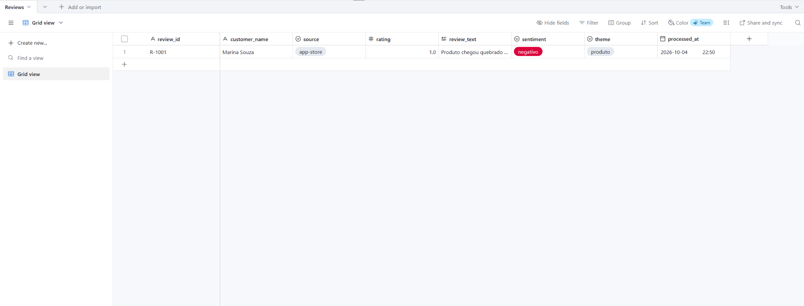

A evidência contém os campos processados, incluindo `review_id`, `customer_name`, `source`, `rating`, `review_text`, `sentiment`, `theme` e `processed_at`.

## 6. Alerta no Slack

Uma avaliação negativa foi encaminhada com sucesso ao Slack.

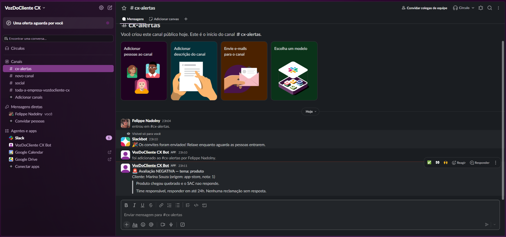

**Comprova:**
- integração do workflow com Slack;
- disparo condicionado a sentimento negativo;
- resposta positiva da API do Slack (`ok: true`).

## 7. Smoke tests no ambiente de desenvolvimento

Foram definidos três cenários básicos de validação:

1. avaliação negativa;
2. avaliação positiva;
3. reenvio de avaliação para validação de duplicidade.

Os testes locais foram executados no endpoint de teste do n8n (`/webhook-test/review`) durante o desenvolvimento.

### Teste negativo

```powershell
curl -Method POST http://localhost:5678/webhook-test/review `
  -ContentType "application/json" `
  -Body '{"review_id":"SMOKE-NEG-001","customer_name":"Cliente Teste Negativo","source":"app-store","rating":1,"review_text":"O produto chegou quebrado e o atendimento nao respondeu."}'
```

### Teste positivo

```powershell
curl -Method POST http://localhost:5678/webhook-test/review `
  -ContentType "application/json" `
  -Body '{"review_id":"SMOKE-POS-001","customer_name":"Cliente Teste Positivo","source":"app-store","rating":5,"review_text":"Produto excelente, chegou rapido e estou muito satisfeito com a compra."}'
```

### Teste duplicado

Foi reenviado o payload do teste negativo para validar o comportamento de duplicidade.

## 8. Smoke tests em produção

Os mesmos cenários foram executados utilizando o endpoint público de produção:

```text
POST https://n8n-production-7813.up.railway.app/webhook/review
```

Os identificadores utilizados incluíram:

- `SMOKE-PROD-NEG-001`;
- `SMOKE-PROD-POS-001`.

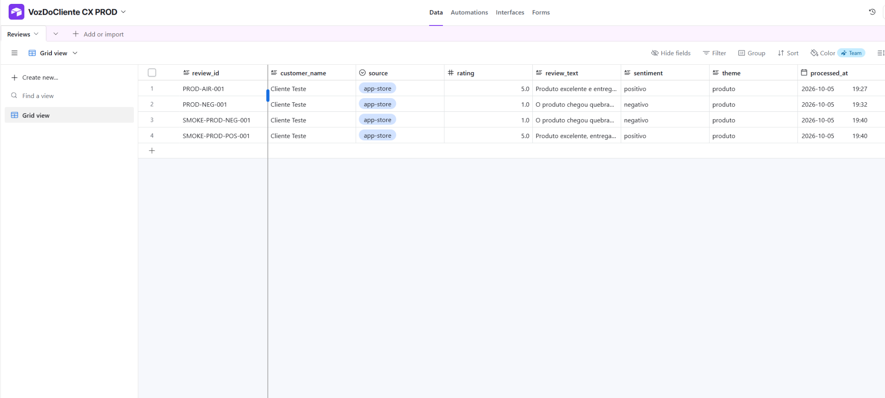

**Resultado:** os registros negativo e positivo foram processados e persistidos no ambiente PROD. O reenvio do identificador negativo foi utilizado para validar a deduplicação sem criar uma nova entrada.

## 9. Integração contínua com GitHub Actions

O repositório possui workflow de CI disparado por `push` na branch `main`.

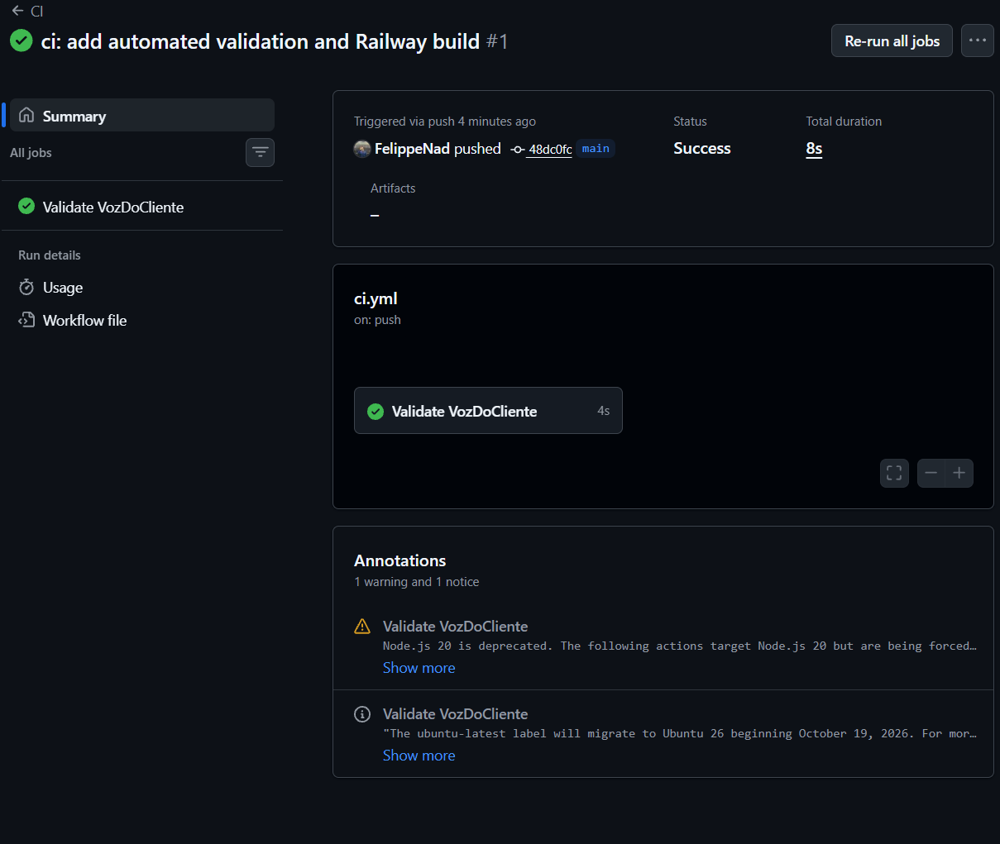

A execução mostrada terminou com status `Success` e validou o projeto através do job `Validate VozDoCliente`.

**Comprova:**
- pipeline automático em GitHub Actions;
- execução após push;
- validação automatizada antes/associada ao processo de entrega.

## 10. Deploy automático no Railway

O mesmo fluxo de alterações no Git foi associado ao serviço n8n no Railway.

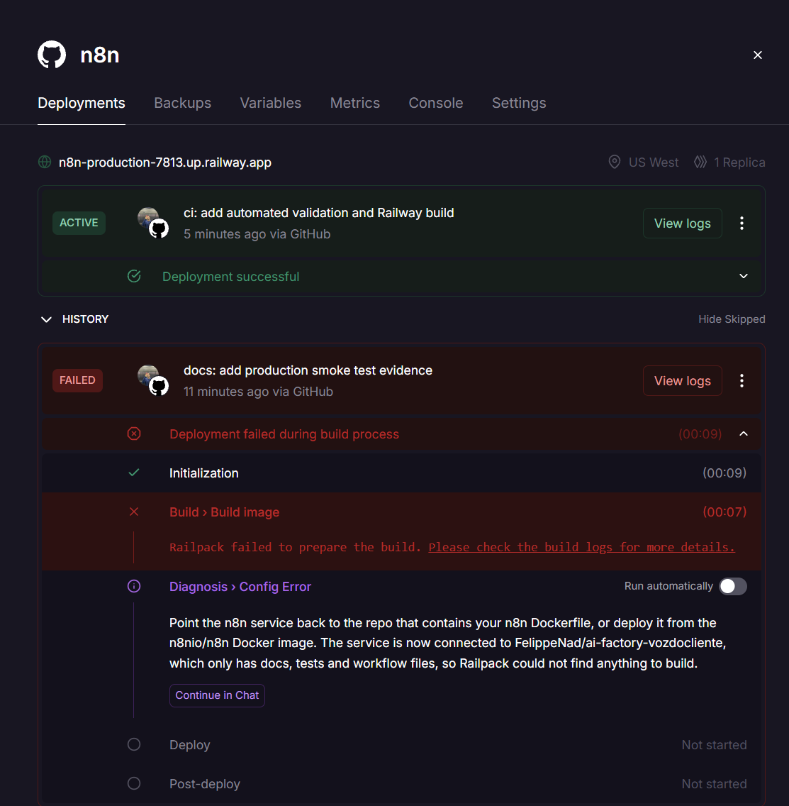

A evidência mostra o deployment `ci: add automated validation and Railway build` como `ACTIVE` e `Deployment successful`, iniciado via GitHub.

**Comprova:**
- repositório conectado ao Railway;
- build e deploy automáticos;
- ambiente público ativo após atualização da branch principal.

## 11. Verificação pós-deploy

Após o deploy automático, foi executado um novo review com o identificador `CICD-VERIFY-001`.

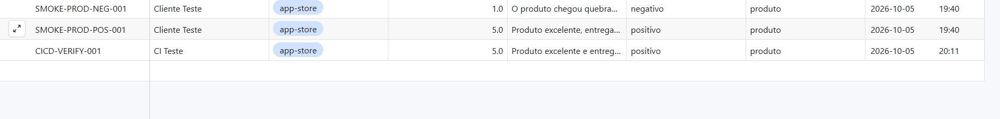

O registro apareceu no Airtable PROD, confirmando que o serviço permaneceu funcional após o processo de CI/CD.

## 12. Teste de rollback

O histórico de deployments do Railway foi utilizado para restaurar temporariamente um deployment anterior.

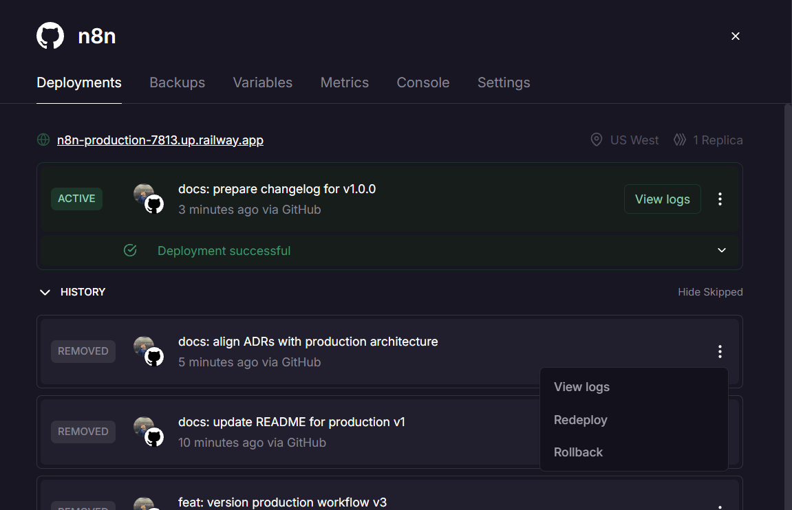

A plataforma exibiu a confirmação explícita de restauração do build e das variáveis daquele deployment:

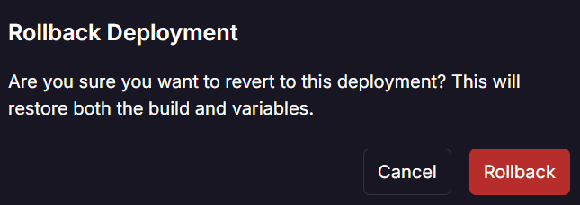

Após o rollback, o endpoint público foi testado com `ROLLBACK-TEST-001` e permaneceu funcional. Em seguida, a versão mais recente foi restaurada e validada novamente com `ROLLBACK-RESTORE-001`.

A descrição completa do procedimento está em `docs/rollback.md`.

## 13. Verificação de segurança

Antes do fechamento da versão `v1.0.0`, o histórico Git foi analisado com Gitleaks.

Comando utilizado:

```powershell
docker run --rm `
  -v "${PWD}:/repo" `
  ghcr.io/gitleaks/gitleaks:latest `
  git --verbose --redact /repo
```

Resultado registrado:

```text
15 commits scanned
no leaks found
```

Uma segunda varredura sobre o diretório local identificou apenas o arquivo `n8n-mirror/.env`, que está corretamente ignorado pelo Git. A confirmação foi feita com:

```powershell
git check-ignore -v n8n-mirror/.env
git ls-files n8n-mirror/.env
```

O `.env` não aparece nos arquivos versionados.

## 14. Resultado geral

As evidências reunidas demonstram:

- workflow funcional em desenvolvimento;
- classificação por LLM;
- persistência no Airtable;
- alerta condicional no Slack;
- smoke tests em DEV e PROD;
- endpoint público independente da máquina local;
- CI com GitHub Actions;
- deploy automático no Railway;
- validação pós-deploy;
- rollback testado;
- verificação do histórico Git sem secrets detectados.

Para complementar a apresentação final, podem ser adicionadas posteriormente capturas da GitHub Release `v1.0.0` e, se desejado, do deployment restaurado após o teste de rollback.
